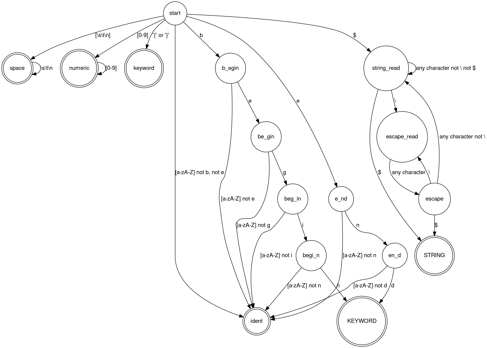

% Лабораторная работа № 1.4 «Лексический распознаватель»
% 17 апреля 2024 г.
% Егор Поршенко, ИУ9-61Б

# Цель работы
Целью данной работы является изучение использования детерминированных конечных автоматов с размеченными
заключительными состояниями (лексических распознавателей) для решения задачи лексического анализа.

# Индивидуальный вариант
begin, end, {, }, строковые литералы ограничены знаками $, допустимы escape-последовательности 
вида `\x`, где x — любой символ, не могут пересекать границы строк текста.

# Реализация

Лексическая структура языка — регулярные выражения для доменов:

* SPACE `[\s\t\n]`
* NUMERIC `[0-9]+`
* KEYWORD `{|}|begin|end`
* IDENT `(?!begin|end)[a-zA-Z]+`
* STRING `$.*$`

Граф детерминированного распознавателя:



Реализация распознавателя:

Файл `Position.scala`:
```scala
package model

case class Position(line: Int, pos: Int, index: Int) {
  override def toString: String = s"($line, $pos)"
  def isEmpty: Boolean = line == -1 && pos == -1 && index == -1
  def equalTo(other: Position): Boolean = line == other.line && pos == other.pos && index == other.index
}

object Position {
  def apply(): Position = Position(1, 1, 0)
  def empty: Position = Position(-1, -1, -1)
}
```

Файл `Fragment.scala`:
```scala
package model

case class Fragment(start: Position, follow: Position) {
  override def toString: String = s"${start.toString}-${follow.toString}"
  def isEmpty: Boolean = start.isEmpty && follow.isEmpty
}

object Fragment {
  def empty(): Fragment = Fragment(Position.empty, Position.empty)
}
```

Файл `Acceptable.scala`:
```scala
package model

case class Acceptable(chars: Set[Char]) {
  def ++(other: Acceptable): Acceptable = Acceptable(chars ++ other.chars)
  def +(chr: Char): Acceptable = Acceptable(chars + chr)
  def --(other: Acceptable): Acceptable = Acceptable(chars -- other.chars)
  def -(chr: Char): Acceptable = Acceptable(chars - chr)
}

object Acceptable {
  val spaces: Acceptable = Acceptable(Set('\n', '\t', ' '))
  val digits: Acceptable = Acceptable('0'.toInt.to('9'.toInt).map(_.toChar).toSet)
  val lowerLetters: Acceptable = Acceptable('a'.toInt.to('z'.toInt).map(_.toChar).toSet)
  val upperLetters: Acceptable = Acceptable('A'.toInt.to('Z'.toInt).map(_.toChar).toSet)
  val any: Acceptable = Acceptable(32.to(126).map(_.toChar).toSet)
  val digitsAndLetters: Acceptable = digits ++ lowerLetters ++ upperLetters
  val letters: Acceptable = lowerLetters ++ upperLetters
}
```

Файл `DFA.scala`:
```scala
package model

class DFA(val currentState: State,
          val startState: State,
          val finalStates: Vector[State],
          val table: Map[State, Vector[(Acceptable, State)]]) {
  def next(symbol: Char): (Either[Unit, Boolean], DFA) = {
    table.getOrElse(currentState, Vector.empty).find(_._1.chars.contains(symbol)) match {
      case Some(dest) => (Right(finalStates.contains(dest._2)), new DFA(dest._2, startState, finalStates,
table))
      case None => (Left(()), this)
    }
  }
}

object DFA {
  def start(): DFA = new DFA(Start, Start, finalStates, table)

  val finalStates: Vector[State] = Vector(Space, Numeric, KeywordBrace, Keyword, Ident, String)
  val table: Map[State, Vector[(Acceptable, State)]] = Map(
    (Start,
      Vector(
        (Acceptable.spaces, Space),
        (Acceptable.digits, Numeric),
        (Acceptable(Set('{', '}')), KeywordBrace),
        (Acceptable(Set('b')), B_egin),
        (Acceptable(Set('e')), E_nd),
        (Acceptable(Set('$')), StringRead),
        (Acceptable.letters - 'b' - 'e', Ident)
      )
    ),
    (Space,
      Vector(
        (Acceptable.spaces, Space)
      )
    ),
    (Numeric,
      Vector(
        (Acceptable.digits, Numeric)
      )
    ),
    (StringRead,
      Vector(
        (Acceptable.any - '\\' - '$', StringRead),
        (Acceptable(Set('$')), String),
        (Acceptable(Set('\\')), EscapeRead)
      )
    ),
    (EscapeRead,
      Vector(
        (Acceptable.any, Escape)
      )
    ),
    (Escape,
      Vector(
        (Acceptable(Set('\\')), EscapeRead),
        (Acceptable.any - '\\', StringRead),
        (Acceptable(Set('$')), String)
      )
    ),
    (B_egin,
      Vector(
        (Acceptable.digitsAndLetters - 'e', Ident),
        (Acceptable(Set('e')), Be_gin)
      )
    ),
    (Be_gin,
      Vector(
        (Acceptable.digitsAndLetters - 'g', Ident),
        (Acceptable(Set('g')), Beg_in)
      )
    ),
    (Beg_in,
      Vector(
        (Acceptable.digitsAndLetters - 'i', Ident),
        (Acceptable(Set('i')), Begi_n)
      )
    ),
    (Begi_n,
      Vector(
        (Acceptable.digitsAndLetters - 'n', Ident),
        (Acceptable(Set('n')), Keyword)
      )
    ),
    (E_nd,
      Vector(
        (Acceptable.digitsAndLetters - 'n', Ident),
        (Acceptable(Set('n')), En_d)
      )
    ),
    (En_d,
      Vector(
        (Acceptable.digitsAndLetters - 'd', Ident),
        (Acceptable(Set('d')), Keyword)
      )
    ),
    (Keyword,
      Vector(
        (Acceptable.digitsAndLetters, Ident)
      )
    ),
    (Ident,
      Vector(
        (Acceptable.digitsAndLetters, Ident)
      )
    )
  )
}
```

Файл `Lexer.scala`:
```scala
package model

import scala.annotation.tailrec

class Lexer(text: String,
            dfa: DFA,
            val currentPosition: Position) {


  private def isNewLineAt(position: Position): Boolean = {
    if (text.charAt(position.index) == '\r' && position.index < text.length)
      text.charAt(position.index + 1) == '\n'
    else
      text.charAt(position.index) == '\n'
  }

  private def isEOLAt(position: Position): Boolean = {
    text.charAt(position.index) == '\u0000'
  }

  private def nextPositionFrom(position: Position): Position = {
    val (updatedLine, updatedPos, updatedIndex) =
      if (position.index != text.length) {
        if (isNewLineAt(position)) {
          if (text.charAt(position.index) == '\r') {
            (position.line + 1, 1, position.index + 2)
          } else {
            (position.line + 1, 1, position.index + 1)
          }
        } else {
          (position.line, position.pos + 1, position.index + 1)
        }
      } else {
        (position.line, position.pos, position.index)
      }
    Position(updatedLine, updatedPos, updatedIndex)
  }

  @tailrec
  private def transit(currentDFA: DFA = dfa, currentPosition: Position, startPosition: Position)
                     (isCompleted: Boolean, completedPosition: Position, completedState: State): Token = {
    import Lexer.StringOps

    val currentChar = text.charAt(currentPosition.index)
    val nextPosition = nextPositionFrom(currentPosition)

    val (status, updatedDFA) = currentDFA.next(currentChar)
//    println(s"${currentChar} -- ${currentDFA.currentState} -> ${updatedDFA.currentState}")
    status match {
      case Left(_) =>
        if (isCompleted) {
          CommonToken(
            completedState.name,
            Fragment(startPosition, completedPosition),
            Some(text.substring(startPosition.index, completedPosition.index + 1).backSlashNewLine))
        } else {
          ErrorToken(
            "Error",
            Fragment(startPosition, currentPosition),
            Some(text.substring(startPosition.index, currentPosition.index + 1).backSlashNewLine))
        }
      case Right(true) =>
        transit(updatedDFA, nextPosition, startPosition)(isCompleted = true, currentPosition,
updatedDFA.currentState) // final
      case Right(false) =>
        transit(updatedDFA, nextPosition, startPosition)(isCompleted, completedPosition, completedState)
    }
  }

  def nextToken(): NextTokenResult = {
    val startPosition: Position = currentPosition.copy()

    if (currentPosition.index == text.length || isEOLAt(currentPosition)) {
      NextTokenResult(EndToken(), this)
    } else {
      val token = transit(DFA.start(), startPosition, startPosition)(isCompleted = false, Position.empty,
Trap)
      NextTokenResult(token, new Lexer(text, DFA.start(), nextPositionFrom(token.fragment.follow)))
    }
  }
}

object Lexer {
  def apply(input: String): Lexer = {
    new Lexer(input + '\u0000', DFA.start(), Position())
  }

  def getTokens(lexer: Lexer): Vector[Token] = {
    @tailrec
    def loop(currentLexer: Lexer)(acc: Vector[Token] = Vector.empty): Vector[Token] = {
      val result = currentLexer.nextToken()
//      println(result.token)
//      println(result.lexer.currentPosition)
      result.token match {
        case EndToken(_, _, _) => acc
        case ct@CommonToken(_, _, _ ) =>
           loop(result.lexer)(acc :+ ct)
        case ErrorToken(name, fragment, value) =>
          println(s"ERROR: $fragment : $value")
          loop(result.lexer)(acc)
      }
    }

    loop(lexer)()
  }

  implicit class StringOps(value: String) {
    def backSlashNewLine: String = value.replace("\n", "\\n")
  }
}

trait Token {
  def name: String
  def fragment: Fragment
  def value: Option[String]
}
case class CommonToken(name: String, fragment: Fragment, value: Option[String] = None) extends Token
case class ErrorToken(name: String, fragment: Fragment, value: Option[String] = None) extends Token
case class EndToken(name: String = "End", fragment: Fragment = Fragment.empty(), value: Option[String] =
None) extends Token
case class NextTokenResult(token: Token, lexer: Lexer)
```

# Тестирование

Входные данные

```
beginend
127465412 $string value$
=[]wer 90ijkasdf;'lisjdm;klsdjmn

begin {
    1 \* 2
    3 \+ 6
    12390358 \\ 0008756
    abacaba + bacabada
} end
```

Вывод на `stdout`

```
ERROR: (3, 1)-(3, 1) : Some(=)
ERROR: (3, 2)-(3, 2) : Some([)
ERROR: (3, 3)-(3, 3) : Some(])
ERROR: (3, 17)-(3, 17) : Some(;)
ERROR: (3, 18)-(3, 18) : Some(')
ERROR: (3, 25)-(3, 25) : Some(;)
ERROR: (6, 7)-(6, 7) : Some(\)
ERROR: (6, 8)-(6, 8) : Some(*)
ERROR: (7, 7)-(7, 7) : Some(\)
ERROR: (7, 8)-(7, 8) : Some(+)
ERROR: (8, 14)-(8, 14) : Some(\)
ERROR: (8, 15)-(8, 15) : Some(\)
ERROR: (9, 13)-(9, 13) : Some(+)
=============================
CommonToken(Ident,(1, 1)-(1, 8),Some(beginend))
CommonToken(Space,(1, 9)-(1, 9),Some(\n))
CommonToken(Numeric,(2, 1)-(2, 9),Some(127465412))
CommonToken(Space,(2, 10)-(2, 10),Some( ))
CommonToken(String,(2, 11)-(2, 24),Some($string value$))
CommonToken(Space,(2, 25)-(2, 25),Some(\n))
CommonToken(Ident,(3, 4)-(3, 6),Some(wer))
CommonToken(Space,(3, 7)-(3, 7),Some( ))
CommonToken(Numeric,(3, 8)-(3, 9),Some(90))
CommonToken(Ident,(3, 10)-(3, 16),Some(ijkasdf))
CommonToken(Ident,(3, 19)-(3, 24),Some(lisjdm))
CommonToken(Ident,(3, 26)-(3, 32),Some(klsdjmn))
CommonToken(Space,(3, 33)-(4, 1),Some(\n\n))
CommonToken(Keyword,(5, 1)-(5, 5),Some(begin))
CommonToken(Space,(5, 6)-(5, 6),Some( ))
CommonToken(Keyword,(5, 7)-(5, 7),Some({))
CommonToken(Space,(5, 8)-(6, 4),Some(\n    ))
CommonToken(Numeric,(6, 5)-(6, 5),Some(1))
CommonToken(Space,(6, 6)-(6, 6),Some( ))
CommonToken(Space,(6, 9)-(6, 9),Some( ))
CommonToken(Numeric,(6, 10)-(6, 10),Some(2))
CommonToken(Space,(6, 11)-(7, 4),Some(\n    ))
CommonToken(Numeric,(7, 5)-(7, 5),Some(3))
CommonToken(Space,(7, 6)-(7, 6),Some( ))
CommonToken(Space,(7, 9)-(7, 9),Some( ))
CommonToken(Numeric,(7, 10)-(7, 10),Some(6))
CommonToken(Space,(7, 11)-(8, 4),Some(\n    ))
CommonToken(Numeric,(8, 5)-(8, 12),Some(12390358))
CommonToken(Space,(8, 13)-(8, 13),Some( ))
CommonToken(Space,(8, 16)-(8, 16),Some( ))
CommonToken(Numeric,(8, 17)-(8, 23),Some(0008756))
CommonToken(Space,(8, 24)-(9, 4),Some(\n    ))
CommonToken(Ident,(9, 5)-(9, 11),Some(abacaba))
CommonToken(Space,(9, 12)-(9, 12),Some( ))
CommonToken(Space,(9, 14)-(9, 14),Some( ))
CommonToken(Ident,(9, 15)-(9, 22),Some(bacabada))
CommonToken(Space,(9, 23)-(9, 23),Some(\n))
CommonToken(Keyword,(10, 1)-(10, 1),Some(}))
CommonToken(Space,(10, 2)-(10, 2),Some( ))
CommonToken(Keyword,(10, 3)-(10, 5),Some(end))
```

# Вывод
В результате выполнения лабораторной работы ознакомился с концепцией
детерменированных конечных автоматов с размеченными состояниями
для решения задач лексического анализа. Такой подход оказался довольно удобным, 
однако трудоёмок в реализации, поскольку пришлось описывать состояния для каждого символа ключевых слов
и определять корректные переводы (т.к. домен идентификаторов пересекался с доменом ключевых слов).
Можно было бы придумать более хитрый алгоритм для решения этой проблемы 
(например, не выделять специальные состояния для ключевых слов, 
а до достижения финального состояния идентификатора хранить прочитанные символы, 
а затем сопоставлять их с доменом ключевых слов при достижении финального состояния), 
но сложность такого алгоритма была бы больше, чем линейная.

Также данный лексический анализатор был написан в чисто функциональном стиле на языке Scala.